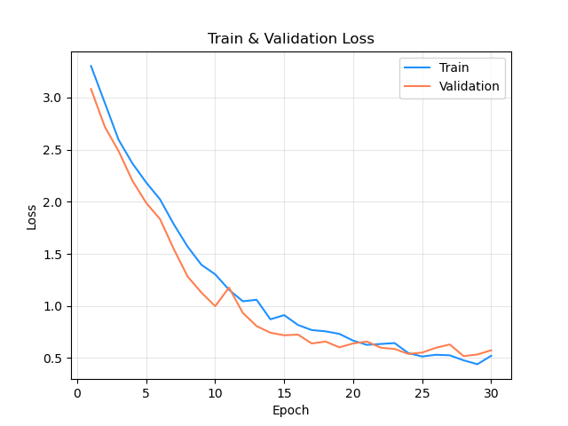
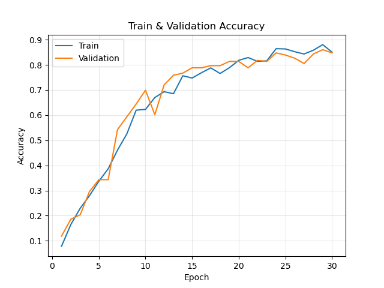
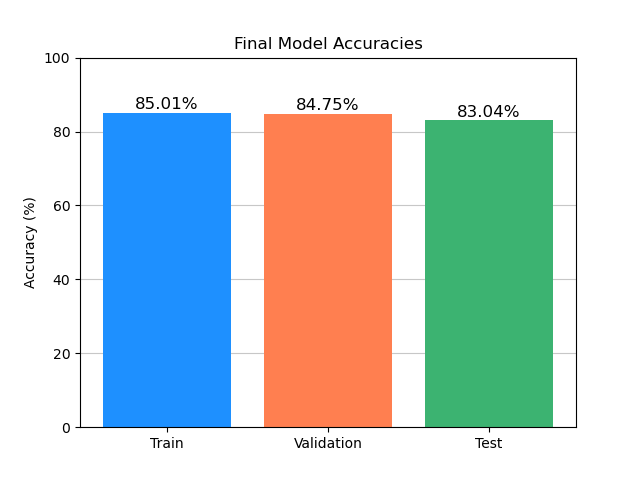
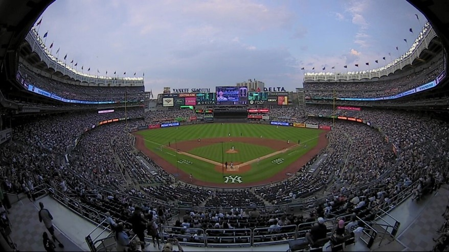
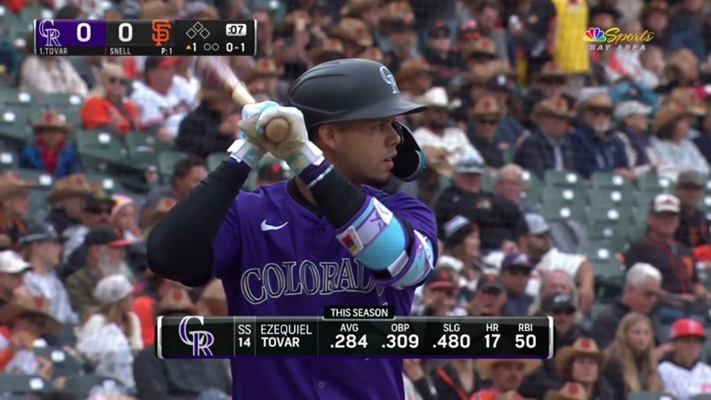

## Ballpark Classifier

This project consists of a model to classify an MLB ballpark from TV broadcast stills of all 30 parks. There is a growing need in baseball for models and projects that contribute to the use of computer vision, and this project is meant to contribute to that need. Practically, this project could have several use cases, not limited to the sorting and labeling of video and images for organizational purposes as well as to help advance the creation of new models and computer vision projects. 

The image data for the project comes from the BaseballCV repository created by Dylan Drummey and Carlos Marcano, and can be found at this link:
https://github.com/dylandru/BaseballCV/tree/main/datasets/raw_photos

The full dataset contains 10,000 unlabeled stills from MLB broadcasts. For use in the project, 1,515 images were manually labeled with the correct ballpark classification. PyTorch’s ImageFolder is used for assigning labels to the images. 
To train the model, use the train.py script. It will use dataloader.py to gather the data and train the DeepCNN model found in models.py. train.py is pre-loaded with tuned hyperparameters using Optuna, the code for which can be found in tune.py.

## Results
To evaluate the model, prediction accuracy and visual inspection of predictions were primarily used. The model performed well, achieving an 83.04% accuracy on the test set with 30 classes. 

The final test accuracy is better than I expected when starting this project, indicating that despite 30 different ballparks and several different types of shots featured in broadcasts that can limit which ballpark features are available in each image, the CNN can effectively learn key ballpark features and classify which ballpark an image is taken from. With this dataset and task, however, there are some caveats to this conclusion, as well as some considerations for future iterations of this task to be had. 

Each ballpark contains its own slightly unique camera angles that are featured in its broadcasts, meaning it is possible that a model could learn to recognize those slight variations in lieu of actual distinct ballpark features. This causes concern when less common shots are featured in the images. For example, the model excels at classifying centerfield angle images, since that is the most common camera angle in a baseball broadcast. Less common shots, like aerial shots and waist-up shots of players, pose a harder challenge for a model since the key features needed are more difficult to learn. 

This aerial shot of Yankee Stadium is found several times in the dataset, and while other stadiums contain aerial shots, this angle is very common in Yankees broadcasts and is likely overrepresented in the data. This led to several misclassifications of aerial shots, for instance this misclassification of T-Mobile Park in Seattle, which features a wide angle and the sky prominently.

 

This example of a waist-up shot of a hitter illustrates the challenge with this type of image, where fewer identifiable ballpark features are present. Team logos are still featured in the score bug, but this is a more detailed and harder-to-learn feature. 

Both examples of challenging classifications can be potentially alleviated with more training data, and there are several more examples of interesting distinct camera angles. Also, considering the success of classifications in this initial iteration of the project, a deeper model may be beneficial for learning these more detailed features to push accuracy even higher.

In a future iteration of this task, I would be interested in attempting to see which features the model does learn because there are some surefire ways to make a correct ballpark classification with a large proportion of the images in the dataset. For example, in images that feature a score bug, the home team’s logo (and therefore the corresponding ballpark) is always present and is always the right or bottom logo (not left). Also, visiting teams are never wearing white pants, so for those images that feature enough of a player’s uniform, a model could conceivably learn which uniform aspects are associated with each team and which ballpark the game is being played in. 

Again, considering the success of this version of the project, a future iteration with sufficient training data and a deeper model would likely perform even better at the task, opening a model like this for real useful applications. 
